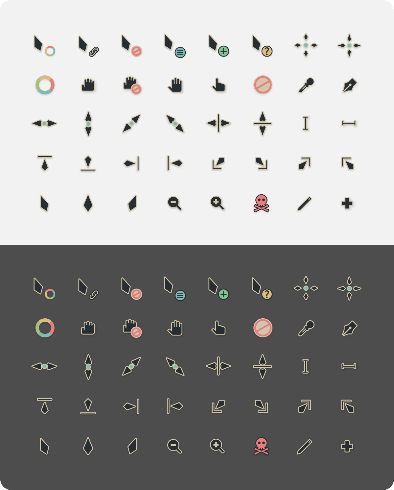

# Vimix forest cursors
This is an x-cursor theme based on [vimix-cursors](https://github.com/vinceliuice/Vimix-cursors) and the [everforest](https://github.com/sainnhe/everforest) color theme.

## Installation
To install the cursor theme simply copy the compiled theme to your icons
directory.

```
./install.sh
```
Will install the theme in `~/.local/share/icons/`, though I personally use `~/.icons`.

```
sudo ./install.sh
```
Will install the theme system-wide, for all users, in `/usr/share/icons/`.

To enable the theme simply set it as active on your prefered desktop tool.

### Windows

The Windows build comes with an INF file to make installation easy.

 1. Open `.windows/` folder in Explorer, and right click on `install.inf`.
 1. Click 'Install' from the context menu, and authorise the modifications to your system.
 1. Press the `Windows Key and R` at the same time and type `main.cpl` in the run promt and press `Ok`.
 1. Go to `Pointers` and select `Vimix Cursors` under the Scheme category.
 1. Click 'Apply'.

## Building from source
You'll find everything you need to build and modify this cursor set in
the `src/` directory. To build the xcursor theme from the SVG source
run:

```
./build.sh
```

This will generate the pixmaps and appropriate aliases.
The freshly compiled cursor theme will be located in `dist/`

### Building depends requirement
- xorg-xcursorgen.
- python-cairosvg.

Fedora/RedHat distros:

    dnf install xorg-xcursorgen python-cairosvg

Ubuntu/Mint/Debian distros:

    sudo apt-get install xorg-xcursorgen python-cairosvg
(I'm currently running Mint. Here it was actually `sudo apt install xorg cairosvg`).

ArchLinux/Manjaro:

    pacman -S xorg-xcursorgen python-cairosvg

Other:
Search for the engines in your distributions repository or install the depends from source.

## Preview


### Misc
When creating the theme I opted for the semi-manual (painful) way. The `autoColour.js` script is meant to be copy-pasted in your browser's devtool while on [SVG Viewer](https://www.svgviewer.dev/). Simply paste the svg contents from `./src/svg/<file-to-edit>` in the site's editor, run the script and make any needed manual changes to the result.
